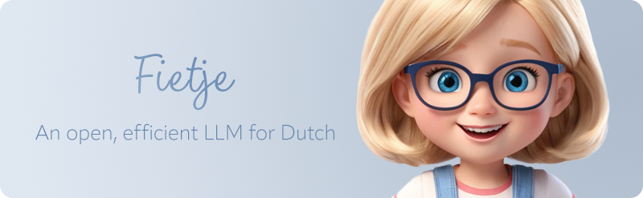
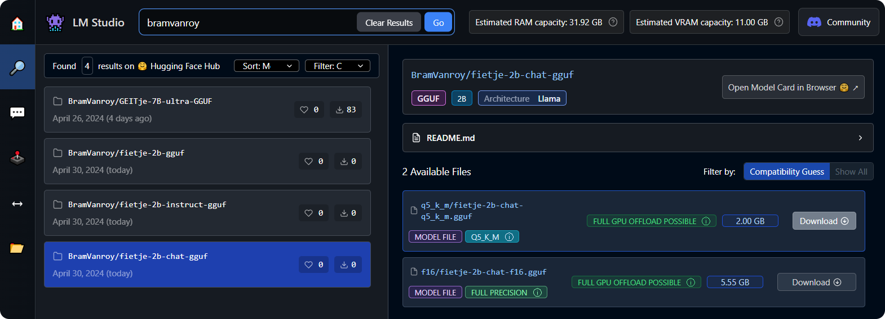
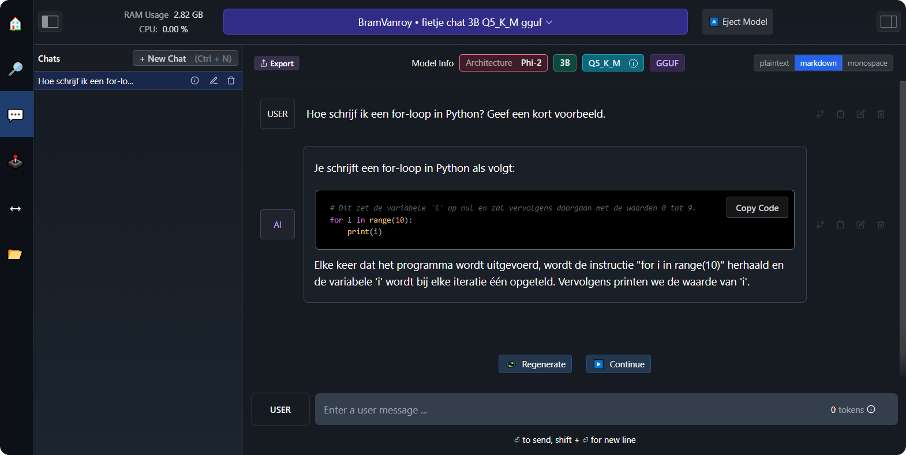
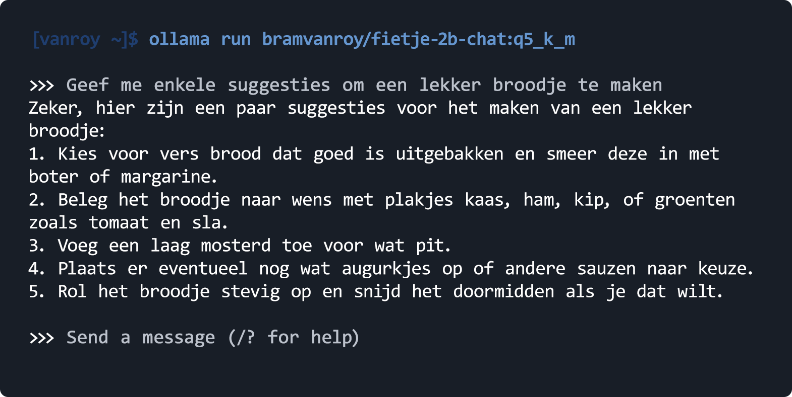

<p align="center">
  
</p>

<div style="margin:auto; text-align:center" align="center">
<h1 style="margin-bottom: 0">Fietje 2B</h1>
<em>An open and efficient LLM for Dutch.</em>
</div>

Fietje is an adapated version of microsoft/phi-2, tailored to Dutch text generation by training on **28B tokens**. It is small and efficient with a size of 2.7 billion parameters while performing almost on par with more powerful Dutch LLMs of twice its size like GEITje 7B Ultra. *In some benchmarks it even beats it!* 😲

Mostly curious about how to use Fietje? Check out some [examples](#how-to-use) below!

## Performance

Despite its small size, Fietje keeps up with other state-of-the-art models adapted for Dutch that are more than twice its size.

The results in this table have been calculated with [ScandEval](https://github.com/ScandEval/ScandEval) (v12.6.1), which automatically runs each benchmark ten times to give a more precise indication of system's performance. Confidence intervals are not reported here so the table below gives a limited view of nuances between models. Furthermore, benchmarks for generative models are inherently flawed. It is hard to capture "quality" of a model - it will always depend on your task and your prompt. Don't trust leaderboards - try out your task with a limited dataset to get a better idea which model works for you!

The important takeaway is that **Fietje punches above its weight class** when it comes to these benchmarks. And that is its goal: to be powerful but efficient!

Full results, including confidence interval and other metrics, will be added to the [ScandEval leaderboard](https://scandeval.com/dutch-nlg/) soon. For now, you can find the raw results (including other models not reported in the table) in [evaluation/scandeval_benchmark_results.jsonl](evaluation/scandeval_benchmark_results.jsonl).

|       model         	        | dutch-social<br>(macro f1) 	 | conll-nl<br>(micro f1) 	 | scala-nl<br>(macro f1) 	 | squad-nl<br>(f1) 	 | wiki-lingua-nl<br>(bertscore) 	 | mmlu-nl<br>(accuracy) 	 | hellaswag-nl<br>(accuracy) 	 | **average** 	|
|:----------------------------:|:----------------------------:|:------------------------:|:------------------------:|:------------------:|:-------------------------------:|:-----------------------:|:----------------------------:|:-----------:	|
|   GEITje-7B-ultra        	   |   **42.30**             	    |   26.26             	    |   50.33             	    |   66.47       	    |   **68.32**                	    |   44.52            	    |   **43.78**             	    | **48.85**   	|
|   GEITje-7B-chat-v2      	   |   40.13                 	    |   31.16             	    |   49.59             	    |   70.19       	    |   65.57                    	    |   44.92            	    |   36.76                 	    | 48.33       	|
| **fietje-2b-chat**         	 |   39.92                 	    |   31.81             	    |   50.99             	    |   71.03       	    |   65.37                    	    |   44.86            	    |   32.71                 	    | 48.10       	|
|   GEITje-7B              	   |   28.11                 	    |   30.04             	    |   **63.76**         	    |   67.54       	    |   66.17                    	    |   44.44            	    |   31.80                 	    | 47.41       	|
| **fietje-2b-instruct**     	 |   40.77                 	    |   28.73             	    |   43.19             	    |   **71.62**   	    |   66.01                    	    |   **44.94**        	    |   34.12                 	    | 47.05       	|
|   GEITje-7B-chat         	   |   27.53                 	    |   36.05             	    |   58.93             	    |   66.72       	    |   66.86                    	    |   42.25            	    |   30.85                 	    | 47.03       	|
|   GEITje-7B-ultra-sft    	   |   35.05                 	    |   30.71             	    |   52.32             	    |   65.67       	    |   67.71                    	    |   42.92            	    |   33.09                 	    | 46.78       	|
|   GEITje-7B-ultra-v2     	   |   31.46                 	    |   32.70             	    |   49.80             	    |   65.49       	    |   67.61                    	    |   42.46            	    |   31.03                 	    | 45.79       	|
| **fietje-2b**              	 |   41.03                 	    |   28.63             	    |   41.28             	    |   69.39       	    |   61.49                    	    |   42.68            	    |   27.19                 	    | 44.53       	|
|   Phi-3-mini-4k-instruct 	   |   29.23                 	    |   **42.76**         	    |   50.26             	    |   48.39       	    |   57.17                    	    |   40.28            	    |   34.69                 	    | 43.26       	|
|   phi-2                  	   |   29.30                 	    |   31.52             	    |   38.18             	    |   36.54       	    |   59.26                    	    |   31.98            	    |   25.71                 	    | 36.07       	|
|   gpt2-medium-dutch      	   |   10.30                 	    |   0.33              	    |   45.08             	    |   1.69        	    |   34.01                    	    |   24.76            	    |   23.61                 	    | 19.97       	|


## Training and data

Want to know more about the training procedure? Have a look at the [training README](training/).

Fietje has undergone three stages: continued pretraining on large volumes of Dutch text, supervised fine-tuning on an instruction dataset, and preference optimalisation on a preference dataset.

- continued pretraining (`fietje-2b`): for the base model, Microsoft's `phi-2` was continue-pretrained on 28B tokens of Dutch text. The dataset includes the full Dutch component of Wikipedia (accounting for around 15%), supplemented with Dutch tokens from CulturaX. A newer version of this dataset can be found here, which also describes the filtering that took place to ensure high data quality.
  - [BramVanroy/wikipedia_culturax_dutch](https://huggingface.co/datasets/BramVanroy/wikipedia_culturax_dutch)
- supervised fine-tuning (`fietje-2b-instruct`): the base model was then fine-tuned on a  instruction dataset, "to teach the model how to have a conversation". Three different datasets were used, two of which are synthetic. Combined, this dataset accounts for 201,579 samples (or "conversations").
  - [BramVanroy/ultrachat_200k_dutch](https://huggingface.co/datasets/BramVanroy/ultrachat_200k_dutch): gpt-4-1106-preview; multi-turn; fully generated (192,598)
  - [BramVanroy/no_robots_dutch](https://huggingface.co/datasets/BramVanroy/no_robots_dutch): gpt-4-1106-preview; prompt translate, answer generated; some items have system messages (8181)
  - [BramVanroy/belebele_dutch](https://huggingface.co/datasets/BramVanroy/belebele_dutch): Dutch portion of [belebele](https://huggingface.co/datasets/facebook/belebele), formatted into SFT format (800)
- preference optimalisation (with DPO; `fietje-2b-chat`): the instruct model underwent a final optimalisation to align it better with what we look for in a good assistant. To do so, cleaned and scored datasets were used to get high-quality preference data, totalling 18,653 samples.
  - [BramVanroy/ultra_feedback_dutch_cleaned](https://huggingface.co/datasets/BramVanroy/ultra_feedback_dutch_cleaned) subset `dpo_hq`: a cleaned version of [BramVanroy/ultra_feedback_dutch](https://huggingface.co/datasets/BramVanroy/ultra_feedback_dutch) (9186)
  - [BramVanroy/orca_dpo_pairs_dutch_cleaned](https://huggingface.co/datasets/BramVanroy/orca_dpo_pairs_dutch_cleaned) subset `dpo_all`: a cleaned version of [BramVanroy/orca_dpo_pairs_dutch](https://huggingface.co/datasets/BramVanroy/orca_dpo_pairs_dutch) (9467)


## How to use

There are a number of different ways to use Fietje 2B. The easiest way is to use the Hugging Face web interface, but you can also use it locally through LM Studio, ollama, or Python. 

If you are a beginner and would like to run an LM locally, I recommend the [LM Studio approach](#local-interface-lm-studio).

### Hugging Face interface

You can use Fietje 2B Chat freely in your browser through the [Hugging Face Space](https://huggingface.co/spaces/BramVanroy/fietje-2b).

### Local interface: LM Studio

The easiest way to get started with Fietje locally, is by using it through a chat interface like [LM Studio](https://lmstudio.ai/), which is a beginner-friendly program to run LLMs on your own device.

1. Download and install [LM Studio](https://lmstudio.ai/).
2. In the sidebar, click on the magnify glass and then search for `bramvanroy` (no space) in the search bar.
3. Click on the model that you want to download. For the chat model, this is `fietje-2b-chat-gguf`. Then select an appropriate quantization method under "Available Files". For starters you can select the most efficient version, which is `q5_k_m`.

<p align="center">
  
</p>

4. When the download has finished, click on the chat icon in the sidebar. 
5. At the top center, select `fietje chat`  and wait for it to load.
6. Start using the interface by talking to the model!

<p align="center">
  
</p>

### Command-line: ollama

All models can be used through the command-line interface [`ollama`](https://github.com/ollama/ollama). This is a more advanced way to interact with the model, but it is also more efficient.

Once you have installed `ollama`, you can easily run the base, instruct, or chat model. You have the option to use a larger `f16` model or a quantized, smaller `q5_k_m` version. The first is larger and likely yields better quality, but the second is much smaller and faster. `q5_k_m` is the default.

All models are available on [my ollama overview page](https://ollama.com/bramvanroy).

```shell
# First make sure that the ollama service is running in the background (e.g., via `screen` or a different terminal)
ollama serve

# Then start the chat model. Download will happen automatically
ollama run bramvanroy/fietje-2b-chat:q5_k_m
```

Example:

<p align="center">
  
</p>

### Python

Rather than using an interface or ollama via the command-line, you can also plainly use the model from good ol' `transformers`.

Here is an example of how to use the model in Python for a one-off generation to create a DnD character. Note that the `pipeline` automatically handles the correct formatting of the conversation according to the required chat template.

```python
from transformers import pipeline, Conversation

# load_in_8bit: lower precision but saves a lot of GPU memory
# attn_implementation: uses flash attention, if your device supports it - otherwise remove it
# device_map=auto: loads the model across multiple GPUs
chatbot = pipeline(
    "conversational",
    model="BramVanroy/fietje-2b-chat",
    model_kwargs={"load_in_8bit": True, "attn_implementation": "flash_attention_2"},
    device_map="auto"
)

start_messages = [
    {"role": "user", "content": "Maak een nieuw DnD personage met de naam 'Bram'. Geef een beschrijving, de skills, en de extra 'traits'' met het aantal punten per vaardigheid. Gebruik JSON. Geef geen extra uitleg."}
]
conversation = Conversation(start_messages)
conversation = chatbot(conversation)
response = conversation.messages[-1]["content"]
print(response)
"""
{
  "naam": "Bram",
  "beschrijving": "Een onverschrokken avonturier met een hart van goud, Bram is een man van weinig woorden, maar met een onuitputtelijke moed. Zijn leven is gevuld met verhalen van overwinningen en verliezen, maar hij draagt ze met een glimlach, wetende dat elke ervaring hem sterker heeft gemaakt."
  "vaardigheden": {
    "wapens": {
      "dolk": 10,
      "zwaard": 8,
      "boog": 6
    },
    "magie": {
      "schaduw": 5,
      "vuur": 4,
      "water": 3
    }
  },
  "extra_traits": {
    "moed": 10,
    "vindingrijkheid": 8,
    "doorzettingsvermogen": 7
  }
}
"""
```

A more elaborate approach is to create a minimalistic chat environment in Python. This is similar to what `ollama` offers, but slower.

```python
from transformers import pipeline, Conversation

# load_in_8bit: lower precision but saves a lot of memory
# attn_implementation: uses flash attention, if your device supports it - otherwise remove it
# device_map=auto: loads the model across multiple GPUs
chatbot = pipeline(
    "conversational",
    model="BramVanroy/fietje-2b-chat",
    model_kwargs={"load_in_8bit": True, "attn_implementation": "flash_attention_2"},
    device_map="auto"
)

while (system_message := input("System message ('q' to quit): ")) != "q":
    start_messages = [
        {"role": "system", "content": system_message},
    ]
    conversation = Conversation(start_messages)
    while (user_input := input("User ('r' to reset): ")) != "r":
        conversation.add_user_input(user_input)
        conversation = chatbot(conversation)
        response = conversation.messages[-1]["content"]
        print("Assistant:", response)
```

## Thanks

- Edwin Rijgersberg, the creator of [the original GEITje](https://github.com/Rijgersberg/GEITje), who showed for the first time (for Dutch) how feasible and powerful continued pretraining can be!
- David Berenstein and others at Argilla, whom I have worked closely with in endeavours to improve dataset quality. [Ultra Feedback Cleaned](https://huggingface.co/datasets/BramVanroy/ultra_feedback_dutch_cleaned) was a joint effort. 
- Hugging Face, especially the `trl` and `alignment-handbook` teams for their patience and excellent work. Special shout-out to my fellow core contributors!
- [The Dutch NLP Community](https://discord.gg/5dJDYeXEVz) for their enthusiasm.
- [Michiel Buisman](https://www.linkedin.com/in/mbuisman/) (UWV) and [Maarten Lens-FitzGerald](https://www.linkedin.com/in/lensfitzgerald/) (SVB) without whom none of this would have been possible. Thanks to project Leesplank we've had the opportunity to create synthetic instruction and preference datasets for Dutch, which are paramount to build powerful assistants.
- The [Flemish Supercomputer Center](https://www.vscentrum.be/) (VSC) for providing the computational resources to train Fietje.
