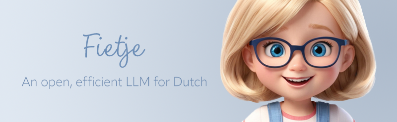

  

<h1 style="margin-bottom: 0">Fietje 2B</h1>
<em>An open and efficient LLM for Dutch.</em>

## How to use

How to use the final chat model. Also references to the cpt and sft models but emphasize that those are not recommended.

add Modelfile for final GGUF

## Performance

Benchmark results

## Reproduction

Transparency, openness

### Training data

28B tokens from wikipedia and culturax, extra filtered

### Training methodology

Alignment handbook; add recipes to github repo
